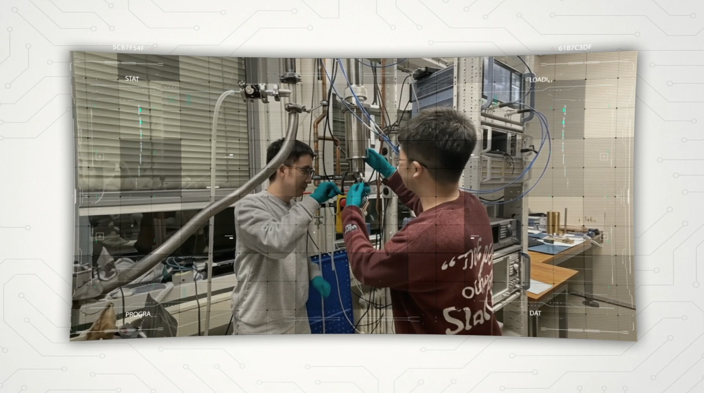

## Project News
+ **QUADRATURE is pleased to present its official video**. Watch it to discover our vision, objectives, and the team behind the project.
      + Link: https://youtu.be/z6VjQhyKt6w

+ Progress Meeting X took place on 15–16 January 2026, hosted by Università di Catania in Sicily, Italy. The discussions during these two days highlighted the significant progress made so far and the exciting work still to come.

+ **QUADRATURE launches “The Circle” Webinar Series**
    + “The Circle” is a space designed for open discussions and idea sharing, inspired by the challenge of “squaring the circle”. The first session, held on 27 October 2025 (Online), featured Mathias Soeken from Microsoft, who presented “Quantum System Architecture for Utility Scale.” This inaugural webinar offered valuable insights into scaling quantum systems towards real-world utility and marked the beginning of an engaging series of exchanges within our growing community.
 

+ QUADRATURE launches its [YouTube channel](https://www.youtube.com/@QUADRATURE-PROJECT) with two video series:

    + #WomenInQuantum: We highlight the inspiring stories of remarkable women to encourage girls and young women to pursue careers in STEM.
    + #QuantumPhD: The youngest members of our team share their PhD/Postdoc journeys.
    

+ Three papers from QUADRATURE partners were presented at IEEE Quantum Week (QCE’25) in Albuquerque in September 2025. The works were presented by Sahar Ben Rached (UPC) and Enrico Russo (UNICT), both PhD students actively contributing to the project.

+ Progress Meeting VIII was held in July 2025 and warmly hosted by our partner Delft University of Technology (The Netherlands). Once again, the whole consortium gathered in person to discuss progress, challenges, and the ambitious road ahead.

+ In January 2025, HiPEAC hosted the workshop "Wireless Interconnects for Scaling Classical and Quantum Computers", where the European Projects QUADRATURE and WINC presented their innovative approaches and potential impact on computing technologies. More info: [https://sites.google.com/view/scqc25].

+ The year 2025 started with another productive plenary meeting, this time in Barcelona. Our partners from Universitat Politècnica de Catalunya (UPC) and Barcelona Supercomputing Center (BSC) warmly welcomed all QUADRATURE international researchers who, over two days, shared intensive discussions about the latest advancements in their research efforts.

+ QUADARTURE’s third plenary meeting took place in June 2024 at the École Polytechnique Fédérale de Lausanne (EPFL) campus at Neuchâtel, Switzerland. They wonderfully hosted our researchers, who travelled from across Europe to continue advancing this revolutionary project.

+ The QUADRATURE partner Equal1 was included on the list of top 10 startups in Dublin compiled by WIRED UK. We do hope that the work developed in the QUADRATURE project on scalable quantum computers integrating multiple quantum cores with quantum-coherent interconnects will make them climb the list even higher!
  
+ Junaid Khan and Pau Escofet, two members of QUADRATURE project co-supervised by Eduard Alarcon, Sergi Abadal and Carmen G. Almudéver, have been awarded two prestigious scholarships to pursue their PhD studies in their group at the Universitat Politècnica de Catalunya (UPC). Junaid has been awarded with the Joan Oró scholarship from the Generalitat de Catalunya (local government in Catalunya), whereas Pau received a scholarship from Universitat Politècnica de Catalunya (UPC) sponsored by Santander Universidades.
  
+ The second meeting of QUADRATURE was hosted by Equal1 in Dublin on 23-24 January 2024. During two days, the consortium's world-leading experts gathered at Equal1 to engage in exciting and productive discussions on various topics related to superconductive cavities and coherent links, cryogenic wireless design, communication within Quantum Packages, Quantum systems architecture and Quantum simulations and benchmarking.

+ Kick-off meeting: The Kick-off Meeting of the Horizon Europe project QUADRATURE was held at UPV in Valencia on the 6-7 of July 2023. We had two days of very exciting discussions to kickstart the project with diversity of experts in the fields of quantum hardware, cryo-CMOS , NoCs, antennas for wireless on-chip communication, quantum computer architecture and quantum algorithms.

## Press
+ [Equal1 Wins Major Pathfinder Grant Award](https://www.equal1.com/post/equal1-wins-major-pathfinder-grant-award).
  
+ Quantum Computing Report Website News: [QUADRATURE Consortium Receives €4 Million ($4.2M USD) from the European Innovation Council to Research Distributed Quantum Cores](https://quantumcomputingreport.com/quadrature-consortium-receives-e4-million-4-2m-usd-from-the-european-innovation-council-to-research-distributed-quantum-cores/).
  
+ HiPEACinfo magazine: [Interview with Carmen G. Almudéver who explains how the QUADRATURE project is working to scale up quantum computing across the stack](https://www.hipeac.net/news/7037/publication-of-hipeacinfo-70/).
  
+ QUANTUM MACHINES: [Women Pushing the Limits of Quantum Computing: Carmen G. Almudéver](https://www.quantum-machines.co/blog/women-pushing-the-limits-of-quantum-computing-carmen-almudever/).
  
+ The Executives: A Dialogue with Majid Mahmood (Podcast). [“Quantum Frontiers: The Journey from Theoretical Algorithms to Real-World Applications”. Interview to Sahar Ben Rached](https://www.youtube.com/watch?v=OOe5DHX1YDA), PhD student at Universitat Politècnica de Catalunya.
  
+ Universidad de La Laguna – Noticias: Almudever: [“Los ordenadores cuánticos resolverán problemas intratables por los supercomputadores actuales”](https://www.ull.es/portal/noticias/2024/almudever-los-ordenadores-cuanticos-resolveran-problemas-intratables-por-los-supercomputadores-actuales/).
  
+ La Vanguardia: La UPV lidera un proyecto europeo sobre ordenares cuánticos financiado con 4,2 millones.
  
+ La Vanguardia: El "cuello de botella" de la computación cuántica, un reto científico centrado en València.
  
+ Europapress: [La UPV lidera un proyecto europeo para avanzar en la implementación de los ordenares cuánticos a gran escala](https://cadenaser.com/comunitat-valenciana/2023/09/02/optimizar-rutas-o-mejorar-las-previsiones-del-tiempo-asi-cambiaran-los-ordenadores-cuanticos-nuestra-vida-diaria-radio-valencia/).
  
+ Ser: [Optimizar rutas o mejorar las previsiones del tiempo: así cambiarán los ordenadores cuánticos nuestra vida diaria](https://cadenaser.com/comunitat-valenciana/2023/09/02/optimizar-rutas-o-mejorar-las-previsiones-del-tiempo-asi-cambiaran-los-ordenadores-cuanticos-nuestra-vida-diaria-radio-valencia/).
  
+ Cadena Ser: [Disponer de ordenadores cuánticos va a tener un impacto profundo en múltiples ámbitos como la economía, el transporte o el energético](https://hokcab01.almacen.api.auditmedia.es//api/Recortes/f05a686f-b0df-4800-a591-7e268d775b69/radio.mp3).
  
+ ValenciaPlaza / AlicantePlaza: El "cuello de botella" de la computación cuántica, un reto científico centrado en València.
  
+ NoticiasDe.es: [La Universidad Politécnica de Valencia (UPV) lidera un proyecto europeo que cuenta con una financiación de 4,2 millones de euros y se centra en la investigación de ordenadores cuántico](https://www.noticiasde.es/comunidad-valenciana/la-universidad-politecnica-de-valencia-upv-lidera-un-proyecto-europeo-que-cuenta-con-una-financiacion-de-42-millones-de-euros-y-se-centra-en-la-investigacion-de-ordenadores-cuanticos/).
  
+ Gente Digital: [La UPV lidera un proyecto europeo sobre ordenares cuánticos financiado con 4,2 millones](http://www.gentedigital.es/valencia/noticia/3695608/la-upv-lidera-un-proyecto-europeo-sobre-ordenares-cuanticos-financiado-con-42-millones/).
  
+ UPV.es: [QUADRATURE. La Universitat Politècnica de València lidera un proyecto europeo para avanzar en la implementación de los ordenares cuánticos a gran escala](https://www.upv.es/noticias-upv/noticia-14379-quadrature-es.html).
  
+ Newsletter UPV Innovación: [https://mailchi.mp/upv/abierta](https://mailchi.mp/upv/abierta).

