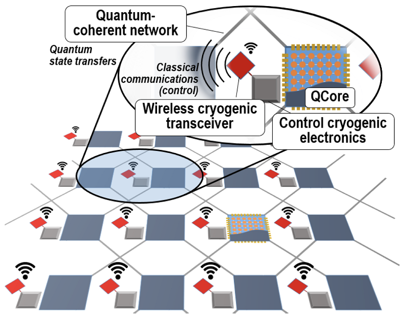

<!---

-->
<!---
## SCALABLE MULTI-CHIP QUANTUM ARCHITECTURES ENABLED BY CRYOGENIC WIRELESS/QUANTUM-COHERENT NETWORK-IN-PACKAGE (QUADRATURE)
-->
## Scalable Multi-Chip Quantum Architectures Enabled by Cryogenic Wireless/Quantum-Coherent Network-in-Package (QUADRATURE)

QUADRATURE is an EU-funded project that aims to take a bold step towards **creating post-NISQ massive quantum processors through the development of scalable architectures with multiple Qcores interconnected via quantum-coherent links within the cryogenic package.**

 
<!---
The project is a collaboration between several universities and industries such as [Universitat Politechnica de Valencia](https://www.upv.es/en), [Universitat Politechnica de Catalunya](https://www.upc.edu/ca), [TU Delft](https://www.tudelft.nl/en/), [University of Siegen](https://www.uni-siegen.de/start/), [Universita Degli Studi di Catania](https://www.unict.it/), [Equal1 Laboratories, Ireland](https://www.equal1.com/), [the Barcelona Supercomputing Center](https://www.bsc.es/), [University College Dublin](https://www.ucd.ie/), and the [Ecole Polytechnique Federale de Lausanne (EPFL)](https://www.epfl.ch/en/). 
-->

## The Project
 

Today’s tremendous interdisciplinary efforts towards building a quantum computer is aimed at a machine capable of tackling problems beyond the reach of any classical computer. The so-called quantum advantage has been already claimed with state-of-the-art Noisy Intermediate-Scale Quantum (NISQ) computers consisting of several tens of quantum bits (qubits).  Nevertheless, it is widely recognized that addressing any real-world problem will require upscaling to thousands or even millions of qubits. Scaling quantum computers to such a large number of qubits is a major challenge due to, among others, the confluence of (i) technology factors confining the qubits to low fidelity, (ii) the need for cryogenic temperatures to reach practical coherence times, (iii) the dense integration of digital/RF control circuits, which are needed on a per-qubit basis , and (iv) the manifold architectural and algorithmic implications of managing noisy and short-lived qubits. 

**The QUADRATURE focuses upon the grand challenge of scalability in quantum computers from an architectural or full-stack standpoint.** We are aiming to explore the feasibility of architectures composed of multiple quantum processors (Qcores) that allow to scale up quantum computing systems. This is enabled by networks-in-a-package with a dual character that includes a quantum-coherent link for quantum information transfers coexisting with a cryogenic wireless communication network for exchanging classical data and synchronization.

 

## The Consortium

The QUADRATURE consortium gathers world-leading experts not only in the required disciplines, but also pioneers in the very specific topics covered in scalable quantum hardware, cryo-CMOS, quantum computer architecture, wireless network-on-chip, integrated antennas, RF transceiver SoCs, and simulation of quantum algorithms. 
 
 
The QUADRATURE consortium consists of: 
+ [Universitat Politècnica de València (UPV, Spain)](https://www.upv.es/en) – Project coordinator

+ [Universitat Politècnica de Catalunya (UPC, Spain)](https://www.upc.edu/ca)
  
+ [Delft University of Technology (TU Delft, The Netherlands)](https://www.tudelft.nl/en/)
  
+ [University of Siegen (UoS, Germany)](https://www.uni-siegen.de/start/)
  
+ [University of Catania (UNICT, Italy)](https://www.unict.it/)
  
+ [Equal 1 (Ireland)](https://www.equal1.com/)
  
+ [Barcelona Supercomputing Center (BSC, Spain)](https://www.bsc.es/)
  
+ [University College Dublin (UCD, Ireland)](https://www.ucd.ie/)
  
+ [École Polytechnique Fédérale de Lausanne (EPFL, Switzerland)](https://www.epfl.ch/en/)

<!---
-->

 
 This project has received funding from the European Union’s Horizon Pathfinder program, under grant agreement No  101099697. 

 

