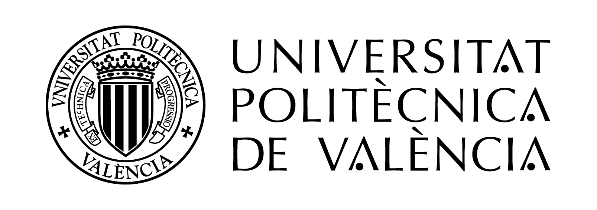
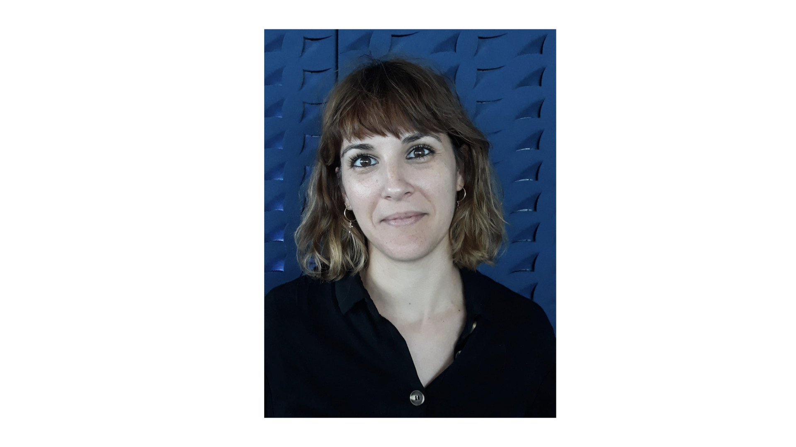

<!---
	Details about sidebar info is provided inside _data/navigation.yml file
-->
 
## Meet the Team

 **UPV (Project coordinator):** PI - [Dr. Carmen G. Almudever](https://www.linkedin.com/in/carmengalmudever/) 
The UPV team, which coordinates the project, has a broad expertise in the field of quantum computing architectures and the design and development of full-stack quantum systems as well as world-leading expertise in on-chip interconnection networks. 

